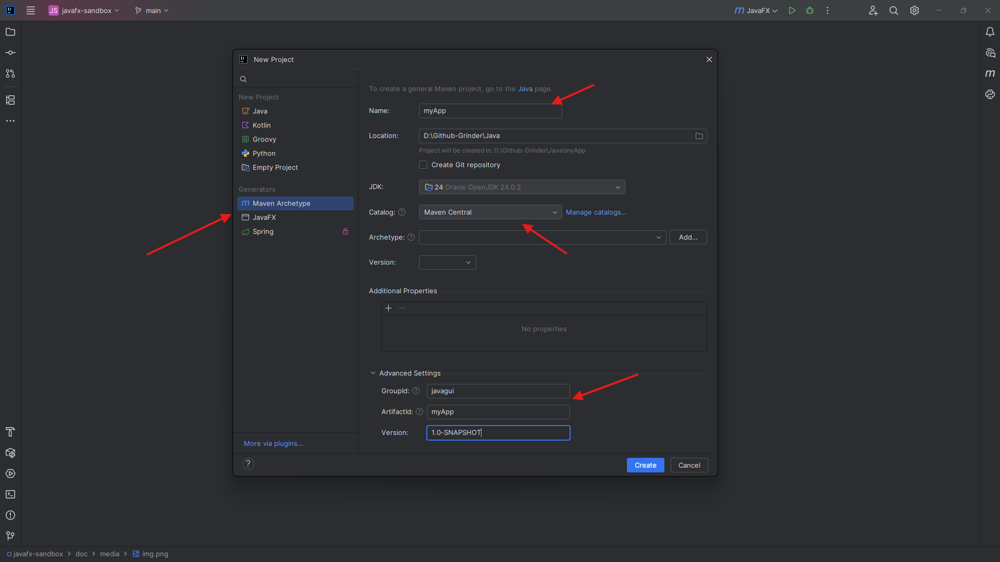
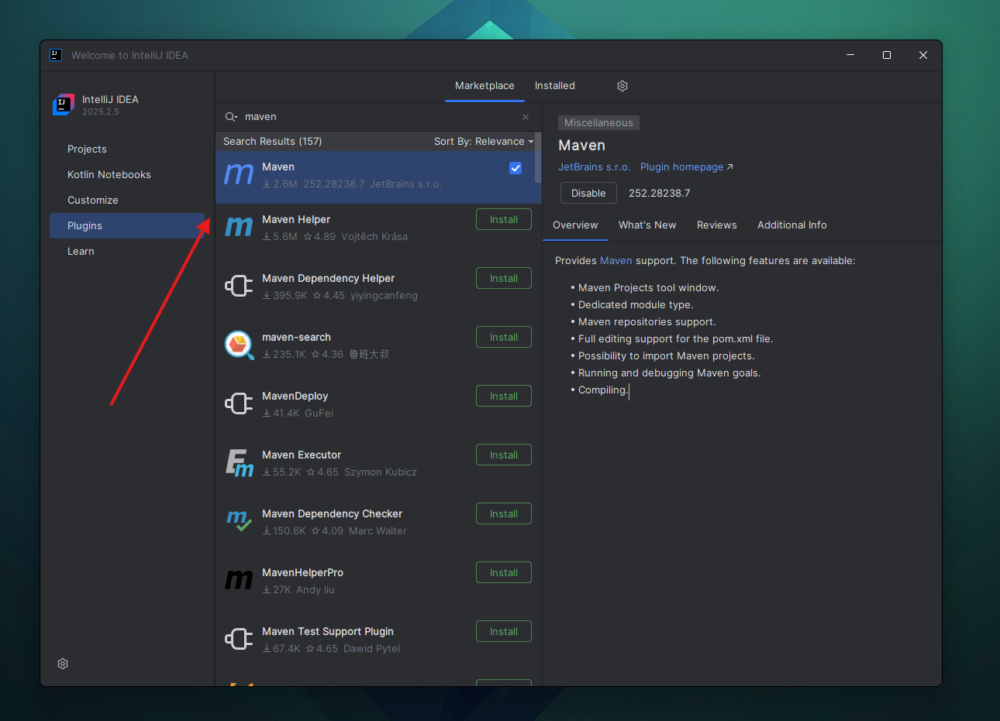
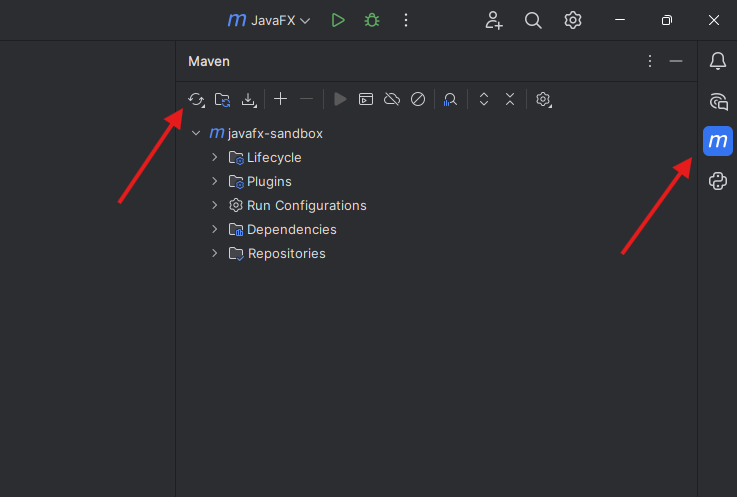

# Konfigurasi pom.xml

Ada banyak automation build tool untuk Java, dan aku menggunakan Maven. Ini mempermudah kita membuat dan mengelola projek. Misal jika kita membutuhkan library tertentu, kita tidak perlu repot-repot install dan pasang manual, cukup copy-paste kode dependency dari [Maven Repository](https://mvnrepository.com/), dan kita sudah berhasil memasang library yang kita mau.

Selain itu, proses build dan lain sebagainya juga bisa dikonfigurasi. Intinya banyak hal menjadi lebih mudah dengan menggunakan bantuan automation build tool Maven ini. Intinya, dengan menggunakan Maven, kita bisa mengalokasikan tugas pemasangan library dengan cepat dan efisien, dan banyak tugas lainya yang bisa diotomatiskan. 

Oleh karena itu, dipilihlah automation build tool Maven ini sebagai projek manager dari repo JavaFX. Jika ingin membuat aplikasi JavaFx dengan menggunakan Maven, maka ikuti dokumentasi ini.

## Memasang Dependency

Untuk bisa menggunakan JavaFX, maka kita perlu memasang library dari JavaFX. Ini bisa dilakukan dengan mudah di Maven, yaitu cukup dengan menambahkan dependency yang dibutuhkan, ikuti panduan berikut:

1. Buat projek baru dengan langsung menggunakan Maven sebagai projek managernya. Jika menggunakan Intellij, proses ini seharusnya mudah, kalau bingung, tanya AI aja, dan pasti bakal tahu kalau proses ini itu mudah. Baiklah, serius kali ini 😤, buat projek baru dengan memilih opsi ini:

    <div align="center">
        
    </div>

    Pilih projek manager Maven, setelah itu tentukan nama projek yang ingin digunakan, sesuai dengan projek yang ingin dibuat. Setelah itu, pada bagian Catalog, pilih `Maven Central`. Pada bagian Advanced Settings, jika ingin membuat penamaan custom, bisa isi groudID, artifactID, dan Version secara manual. 

> [!TIP]
> Jika belum terlalu paham bagaimana sturktur folder dan cara kerja Maven, maka bagian Advanced Settings yang berisi groupID, artifactID, dan Version tidak perlu diutak-atik. Cukup bagian projek manager, nama projek, dan Catalog.    

2. Pasang dan Enabled plugin Maven, yang bisa dicari didaftar plugin Intellij:

    

    Ini penting supaya kedepanya integrasi dan sinkronisasi dependency Maven bisa dilakukan dengan sekali klik.

> [!CAUTION]
> Jika kamu melakukan `clone` pada repository yang sudah dikelola dengan Maven (terdapat file `pom.xml` di root folder), maka cukup lakukan integrasi Maven pada IDE saja! Artinya cukup ikuti arahan yang diberikan dibawah (no 3), dan tidak perlu lanjut kebawah!
> 
> Tapi jika projek yang dibuat adalah baru, maka langsung lompat ke step 4!

3. Jika projek yang ingin diintegrasikan dari maven sudah dikelola oleh Maven, misal kamu melakukan `clone` pada repository yang berisi projek Java yang sudah dikelola oleh Maven, maka yang perlu kamu lakukan adalah sekedar melakukan integrasi Maven saja.

    Caranya mudah, ikuti step berikut:
   1. Pastikan plugin Maven diatas sudah terpasang.
   2. Cari file yang bernama `pom.xml` di root folder. Pastikan file ini ada di root folder, karena ini menjadi penanda utama bahwa projek ini dikelola dengan Maven.

   3. Klik kanan pada file tersebut, lalu pilih opsi `Maven` -> `Add as Maven Project`. Kadang juga ada yang langsung menampilkan opsi `Add as Maven Project`, itu juga bisa langsung di klik. 
   4. Tahap terakhir adalah pemeriksaan, pastikan di panel kanan terdapat icon **M**, yaitu icon Maven muncul. Lalu proses downloading akan berlangsung, bisa dilihat dikanan bawah jendela Intellij. Dan terakhir, terbentuk folder bernama `target`.
   5. Jika tahap terakhir sudah terlihat di jendela IDE, maka artinya integrasi Maven berhasil dilakukan.

4. Setelah projek baru berhasil dibuat, lihat pada bagian daftar folder, tepatnya di root folder. Akan terdapat sebuah file yang bernama `pom.xml`. Di file inilah kita akan mengkonfigurasi bagaimana Maven seharusnya bekerja. Selanjutnya,  hal yang perlu kita lakukan adalah memasang beberapa dependency yang dibutuhkan, antara lain:
    - [JavaFX Controls](https://mvnrepository.com/artifact/org.openjfx/javafx-controls) - Digunakan untuk mendapatkan komponen UI seperti Button, TextField, Label, dll. Ini yang paling sering dipakai. Salah satu dependency yang bisa dipasang mungkin seperti ini (yang berasal dari versi terbaru):

        ```xml
        <!-- https://mvnrepository.com/artifact/org.openjfx/javafx-controls -->
        <dependency>
            <groupId>org.openjfx</groupId>
            <artifactId>javafx-controls</artifactId>
            <version>26-ea+18</version>
        </dependency>
        ```

    -  [JavaFX FXML](https://mvnrepository.com/artifact/org.openjfx/javafx-fxml) - Digunakan jika ingin membuat tampilan UI dari file FXML. Jika menggunakan SceneBuilder, dependency ini harus ada.

         ```xml
         <!-- https://mvnrepository.com/artifact/org.openjfx/javafx-fxml -->
         <dependency>
             <groupId>org.openjfx</groupId>
             <artifactId>javafx-fxml</artifactId>
             <version>26-ea+18</version>
         </dependency>
         ```

    - [JavaFX Graphics](https://mvnrepository.com/artifact/org.openjfx/javafx-graphics) - Ini adalah modul inti rendering dan scene graph, tanpa ini, JavaFX tidak akan berjalan. Seperti ini kode dependencynya dari versi terbaru:

         ```xml
         <!-- https://mvnrepository.com/artifact/org.openjfx/javafx-graphics -->
         <dependency>
             <groupId>org.openjfx</groupId>
             <artifactId>javafx-graphics</artifactId>
             <version>26-ea+18</version>
         </dependency>
         ```
    - [JavaFX Base](https://mvnrepository.com/artifact/org.openjfx/javafx-base) - Fundamental utilities + property system. Berikut kode dependencynya:

        ```xml
        <!-- https://mvnrepository.com/artifact/org.openjfx/javafx-base -->
        <dependency>
            <groupId>org.openjfx</groupId>
            <artifactId>javafx-base</artifactId>
            <version>26-ea+18</version>
        </dependency>
        ```

    - Beberapa dependency yang bisa dipasang, namun bersifat opsional, antara lain seperti: [javafx-media](https://mvnrepository.com/artifact/org.openjfx/javafx-media), [javafx-web](https://mvnrepository.com/artifact/org.openjfx/javafx-web), [javafx-swing](https://mvnrepository.com/artifact/org.openjfx/javafx-swing), [javafx-swt](https://mvnrepository.com/artifact/org.openjfx/javafx-swt).

5. Setelah memasang semua dependency yang dibutuhkan, maka daftar dependency yang kita punya mungkin menjadi seperti ini:

    ```xml
    <dependencies>
        <!-- https://mvnrepository.com/artifact/org.openjfx/javafx-controls -->
        <dependency>
          <groupId>org.openjfx</groupId>
          <artifactId>javafx-controls</artifactId>
          <version>26-ea+18</version>
        </dependency>
        <!-- https://mvnrepository.com/artifact/org.openjfx/javafx-fxml -->
        <dependency>
            <groupId>org.openjfx</groupId>
            <artifactId>javafx-fxml</artifactId>
            <version>26-ea+18</version>
        </dependency>
        <!-- https://mvnrepository.com/artifact/org.openjfx/javafx-graphics -->
        <dependency>
            <groupId>org.openjfx</groupId>
            <artifactId>javafx-graphics</artifactId>
            <version>26-ea+18</version>
        </dependency>
        <!-- https://mvnrepository.com/artifact/org.openjfx/javafx-base -->
        <dependency>
            <groupId>org.openjfx</groupId>
            <artifactId>javafx-base</artifactId>
            <version>26-ea+18</version>
        </dependency>
    </dependencies>
    ```

   Jika sudah, maka langkah selanjutnya adalah lakukan sinkroninasi file `pom.xml` untuk mengunduh dependency tersebut. 

   <div align="center">
        
    </div>

    Tunggu hingga proses selesai, pastikan tidak ada yang error. Jika ada yang error, baca pesan error tersebut dengan teliti, biasanya masalah terletak pada versi atau artifactID yang tidak dikenali. Jika hal ini terjadi, maka cukup cek lagi dependency tersebut ke Maven Repository, dan salin dependency yang baru.

> [!CAUTION]
> Apabila aplikasi membutuhkan modul lain seperti `javafx-media`, `javafx-graphics`, atau `javafx-web`, modul tersebut dapat ditambahkan sesuai kebutuhan. Namun jika tidak digunakan, maka tidak perlu dipasang, karena hanya akan membebani program dan menjadi bloat.

Jika semua proses berjalan lancar, maka selanjutnya adalah konfigurasi build.

## Konfigurasi Build

Karena JavaFX tidak lagi menjadi bagian dari JDK, Maven perlu tahu modul apa saja yang digunakan, serta class mana yang menjadi titik masuk aplikasi. Semua pengaturan ini ditempatkan di dalam bagian `<build>` pada `pom.xml`.

Sebelum masuk ke konfigurasi detail, mari kita lihat terlebih dahulu plugin apa saja yang diperlukan untuk menjalankan dan membangun aplikasi JavaFX melalui Maven.
Plugin-plugin ini digunakan untuk menjalankan JavaFX langsung dari Maven, serta menghasilkan berkas JAR yang dapat dieksekusi.

1. [JavaFX Maven Plugin](https://mvnrepository.com/artifact/org.openjfx/javafx-maven-plugin) - Plugin utama yang bertugas menjalankan aplikasi JavaFX melalui perintah `mvn javafx:run`. Contoh kode dependency:

    ```xml
    <!-- https://mvnrepository.com/artifact/org.openjfx/javafx-maven-plugin -->
    <dependency>
        <groupId>org.openjfx</groupId>
        <artifactId>javafx-maven-plugin</artifactId>
        <version>0.0.8</version>
    </dependency>
    ```

2. [Apache Maven Shade Plugin](https://mvnrepository.com/artifact/org.apache.maven.plugins/maven-shade-plugin) - Digunakan untuk menghasilkan _fat JAR_ atau _uber-jar_, yaitu JAR yang berisi seluruh dependency aplikasi. Dengan plugin ini, aplikasi dapat dijalankan menggunakan `java -jar` tanpa pengaturan classpath yang rumit.

    ```xml
    <!-- https://mvnrepository.com/artifact/org.apache.maven.plugins/maven-shade-plugin -->
    <dependency>
        <groupId>org.apache.maven.plugins</groupId>
        <artifactId>maven-shade-plugin</artifactId>
        <version>3.6.1</version>
    </dependency>
    ```

3. [Apache Maven Compiler Plugin](https://mvnrepository.com/artifact/org.apache.maven.plugins/maven-compiler-plugin) - Plugin ini memastikan bahwa Maven menggunakan versi bahasa Java yang sesuai dengan JDK yang digunakan saat proses kompilasi.

    ```xml
    <!-- https://mvnrepository.com/artifact/org.apache.maven.plugins/maven-compiler-plugin -->
    <dependency>
        <groupId>org.apache.maven.plugins</groupId>
        <artifactId>maven-compiler-plugin</artifactId>
        <version>3.14.1</version>
    </dependency>
    ```

> [!CAUTION]
> Masing-masing dari plugin diatas perlu konfigurasi tambahan, yang akan dibahas di [konfigurasi final](https://github.com/trihajikhr/javafx-sandbox/blob/main/doc/konfigurasi-awal.md#konfigurasi-pomxml-final)

Sekarang perhatikan bahwa ketiga plugin tersebut dibungkus oleh blok `<dependency>`. Tapi karena kita membutuhkan dependency diatas sebagai plugin, maka ganti blok tersebut menjadi `<plugin>`. Ini karena Maven Repo tidak bisa membedakan apakah sebuah artifact itu akan digunakan sebagai dependency, plugin, exstension, atau tool lain, sehingga kita harus menggantinya secara manual.

Sehingga kode akhir yang didapat adalah sebagai berikut:

```xml
<plugin>
    <groupId>org.openjfx</groupId>
    <artifactId>javafx-maven-plugin</artifactId>
    <version>0.0.8</version>
</plugin>
```

dan...

```xml
<plugin>
    <groupId>org.apache.maven.plugins</groupId>
    <artifactId>maven-shade-plugin</artifactId>
    <version>3.6.1</version>
</plugin>
```

Setelah memahami bahwa snippet dari Maven Repository tidak selalu mencerminkan cara pemakaian yang benar, langkah selanjutnya adalah menuliskan plugin tersebut pada lokasi yang tepat di dalam `pom.xml`.

Dalam Maven, semua plugin harus ditempatkan di dalam bagian `<build>` → `<plugins>`.
Inilah yang membuat Maven tahu bagaimana menjalankan, membangun, atau mengemas aplikasi JavaFX.

Contoh penulisan plugin yang benar:

```xml
<build>
    <plugins>

        <!-- Plugin untuk menjalankan JavaFX -->
        <plugin>
            <groupId>org.openjfx</groupId>
            <artifactId>javafx-maven-plugin</artifactId>
            <version>0.0.8</version>
        </plugin>

        <!-- Plugin untuk membuat fat-jar -->
        <plugin>
            <groupId>org.apache.maven.plugins</groupId>
            <artifactId>maven-shade-plugin</artifactId>
            <version>3.6.1</version>
        </plugin>
        <!-- https://mvnrepository.com/artifact/org.apache.maven.plugins/maven-compiler-plugin -->
        <plugin>
            <groupId>org.apache.maven.plugins</groupId>
            <artifactId>maven-compiler-plugin</artifactId>
            <version>3.14.1</version>
        </plugin>

    </plugins>
</build>
```

Dengan cara ini, Maven akan mengenali kedua plugin tersebut sebagai bagian dari proses build, bukan sebagai dependency runtime.

Jika semua proses berjalan lancar, maka selanjutnya adalah konfigurasi build.
Pada tahap ini, kita perlu memastikan bahwa project memiliki plugin yang tepat—bukan sekadar ada, tapi dipahami kegunaannya. Banyak pemula asal tempel konfigurasi dari StackOverflow, terus bingung sendiri kalau build macet.

## Konfigurasi pom.xml Final

### Plugin JavaFX Maven

Plugin ini memungkinkan aplikasi dijalankan langsung melalui perintah:

```
mvn javafx:run
```

Konfigurasinya sebagai berikut:

```xml
<build>
    <plugins>
        <plugin>
            <groupId>org.openjfx</groupId>
            <artifactId>javafx-maven-plugin</artifactId>
            <version>0.0.8</version>
            <configuration>
                <mainClass>${package-Anda.nama-file-Anda}</mainClass>
            </configuration>
        </plugin>
```

Katakanlah kita memiliki file Java yang menjadi program utama yaitu app.Main. Maka ganti `<mainClass>` menjadi:

```xml
<mainClass>app.Main</mainClass>
```

### Plugin Maven Compiler

Plugin ini memastikan Maven menggunakan versi bahasa Java yang sesuai dengan JDK yang digunakan.

```xml
        <plugin>
            <groupId>org.apache.maven.plugins</groupId>
            <artifactId>maven-compiler-plugin</artifactId>
            <version>3.11.0</version>
            <configuration>
                <source>17</source>
                <target>17</target>
            </configuration>
        </plugin>
```

Versi `source` dan `target` sebaiknya menyesuaikan dengan JDK Anda (misalnya 17, 21, dan seterusnya). Bisa dicek diterminal dengan perintah `java -version`, yang mana hasilnya biasanya seperti ini:

```bash
java version "20.0.2" 2023-07-18
Java(TM) SE Runtime Environment (build 20.0.2+9-78)
Java HotSpot(TM) 64-Bit Server VM (build 20.0.2+9-78, mixed mode, sharing)
```
Sehingga aku perbarui isi dari `source` dan `target` menjadi sebagai berikut:

```xml
<source>20</source>
<target>20</target>
```

> [!CAUTION]
> Catatan: Pada beberapa lingkungan, hasil komando tersebut dapat berbeda dari JDK yang digunakan Maven, terutama jika `JAVA_HOME` dikonfigurasi berbeda atau IDE menggunakan JDK lain. Pastikan `JAVA_HOME` mengarah ke JDK yang benar.

### Plugin Maven Shade (Opsional)

Plugin ini digunakan apabila Anda ingin menghasilkan *fat JAR* atau *uber JAR*, yakni satu berkas JAR yang sudah berisi seluruh dependensi. Dengan ini, aplikasi dapat dijalankan menggunakan:

```
java -jar nama-aplikasi.jar
```

Konfigurasi:

```xml
        <plugin>
            <groupId>org.apache.maven.plugins</groupId>
            <artifactId>maven-shade-plugin</artifactId>
            <version>3.5.0</version>
            <executions>
                <execution>
                    <phase>package</phase>
                    <goals>
                        <goal>shade</goal>
                    </goals>
                    <configuration>
                        <transformers>
                            <transformer implementation="org.apache.maven.plugins.shade.resource.ManifestResourceTransformer">
                                <mainClass>app.Main</mainClass>
                            </transformer>
                        </transformers>
                    </configuration>
                </execution>
            </executions>
        </plugin>
    </plugins>
</build>
```

Konfigurasi di atas:

- Sudah mencakup seluruh kebutuhan dasar untuk menjalankan JavaFX melalui Maven.
- Mendukung pembuatan *fat JAR* apabila diperlukan.
- Menggunakan struktur yang umum dalam pengembangan aplikasi JavaFX modern.
- Dapat digunakan pada Windows, Linux, maupun macOS.

> [!NOTE]
> Sebagai gambaran yang lebih jelas, konfigurasi Maven untuk repo ini bisa dilihat di [pom.xml](../pom.xml)

> [!TIP]
> Proses pembuatan file jar dengan plugin tersebut masih dieskplorasi! Mungkin akan dibahas di latihan mendatang!
