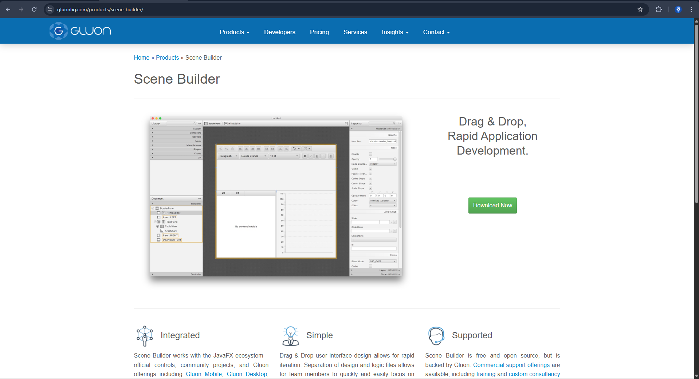

# Scene Builder

Kita anggap kita masih awam terhadap JavaFX. Jadi kita akan membabat habis semua "tanda tanya" sehingga kita bisa memahami dengan lebih baik.

Seperti yang sudah dijelaskan sebelumnya, membuat aplikasi berbasis Graphical User Interface atau GUI pada Java memang umum dilakukan. Dan di Java, biasanya orang-orang akan menggunakan library yang namanya Java Swing. Namun tampilan dari Java Swing terlalu kuno (walaupun sekarang sudah ada [library flatlaf](https://www.formdev.com/flatlaf/) yang bisa membuat tampilan Java Swing menjadi smooth seperti intellij), tidak modular karena tidak memisahkan kode logika dengan kode yang mengatur tampilan, dan modifikasi desain yang terbatas.

Menggunakan fitur _drag-and-drop_ pada library Java Swing juga tidak terlalu disarankan, karena fitur tersebut men generate kode yang sulit dibaca, aneh, dan susah didebug. Intinya pengguna Java modern sudah banyak yang meninggalkan Java Swing ini.

Alternatifnya sekarang adalah apa yang sedang kita pakai, yaitu menggunakan JavaFX. Library untuk membuat Java GUI yang... Well, penjelasan tentang ini sudah dibahas panjang di bagian awal, yaitu [JavaSwing VS JavaFX](javaswing-vs-javafx.md).

Nah, untuk menggunakan JavaFX, kita justru diperbolehkan dan disarankan menggunakan fitur _drag-and-drop_ yang bisa digunakan, yaitu dengan menginstall aplikasi terpisah yang bernama Scene Builder, yang bisa diunduh lewat [Gluonhq](https://gluonhq.com/products/scene-builder/).

## Kenapa menggunakan Scene Builder?

Untuk mengatur tampilan JavaFX, kita bisa menggunakan Java code atau FXML. Tapi karena program yang baik adalah program yang modular dan mudah di maintain, maka kita pisahkan konfigurasi UI ke FXML, dengan membuat file ber ekstensi `.fxml`. File ini akan menjadi tempat dimana tampilan GUI Java diatur. Tetapi menuliskan langsung secara manual jelas tidak efisien. Jadi, akan jauh lebih baik jika menggunakan aplikasi seperti Scene Builder sebagai alat untuk menuliskan isi dari file FXML dengan cara yang lebih efisien dan cepat, yaitu cukup dengan _drag-and-drop._

File FXML ini akan mendeskripsikan UI dari JavaFX, dan kita akan dibuatkan kode dari desain yang kita buat lewat Scene Builder, cukup dengan load file FXML itu dengan:

```java
FXMLLoader.load(getClass().getResource("main-view.fxml"));
```

Maka kita sudah bisa menampilkan program Java dengan desain yang kita mau.

Selain itu, pemisahakan kode membuat program lebih modular. Kita memisahkan kode logika, dengan kode UI. Logika diurus oleh Java, sedangkan UI diurus oleh file FXML. Ini membuat kode kita lebih mudah di maintain, debug, dan lebih mudah melakukan kolaborasi.

Dan alasan terakhir untuk menggunakan Scene Builder, adalah WYSIWYG, atau _What You See Is What You Get._ Fitur seperti:

- responsive layout
- anchor constraints
- vbox/hbox spacing
- alignment control

…lebih mudah dilihat secara visual daripada harus mengetikan “setPadding(new Insets(10))” tiap 3 detik.

Kesimpulanya, tidak wajib menggunakan Scene Builder, kita tetap bisa membuat UI dengan mengetik langsung. Tapi Scene Builder ini akan sangat mempermudah hidup, apalagi jika ingin membuat desain UI yang kompleks.

## Memasang Scene Builder

Untuk bisa menggunakan Scene Builder, unduh terlebih dahulu dari laman web [gluonhq](https://gluonhq.com/products/scene-builder/). 



Setelah berhasil di donwload, lakukan pemasangan seperti aplikasi pada umumnya, langsung next next saja. Supaya lebih rapi, atur dengan benar lokasi folder pemasangan dari aplikasi ini.

Setelah terpasang, buka aplikasi Scene Builder, tampilanya harusnya adalah seperti ini:


Jika ingin membuat desain GUI dengan JavaFX, maka pilih versi desktop. Dan... waktunya berkreasi, mendesain tampilan UI dari projekan Javamu 😀.