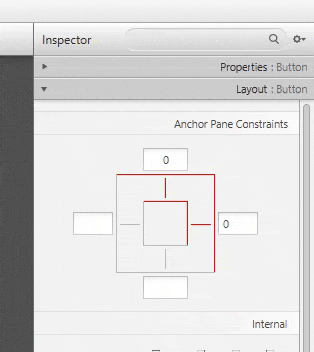

# ⚓ AnchorPane di JavaFX

  
  

**`AnchorPane`** adalah salah satu kontainer tata letak (Layout Pane) yang paling sederhana dan paling fleksibel di JavaFX. Fungsinya adalah untuk **menambatkan** atau **mengunci** posisi sebuah Node (komponen UI, seperti tombol atau bidang teks) relatif terhadap sisi (tepi) kontainernya sendiri.

Pada demo di atas, bagian kiri memperlihatkan cara kerja `AnchorPane`, misalnya bagaimana sebuah `Button` bisa tetap menempel pada tepi container. Setiap node yang berada di dalam `AnchorPane` memiliki aturan layout tersendiri, di mana posisinya dapat diatur berdasarkan sisi-sisi `AnchorPane`. Sementara itu, video di sebelah kanan menampilkan konfigurasi layout yang digunakan untuk mencapai posisi tersebut.

## 1. Konsep Dasar

Berbeda dengan `VBox` atau `GridPane` yang mengatur elemen secara otomatis, `AnchorPane` memberikan Anda **kontrol mutlak** atas posisi setiap Node anak.

* **Penambatan (Anchoring)**: Anda mendefinisikan jarak yang harus dipertahankan oleh Node anak dari tepi kontainer `AnchorPane` (Top, Bottom, Left, Right).
* **Properti Static**: Jarak penambatan ini ditetapkan menggunakan properti static, misalnya:
    * `AnchorPane.setTopAnchor(node, value)`
    * `AnchorPane.setRightAnchor(node, value)`
    * `AnchorPane.setBottomAnchor(node, value)`
    * `AnchorPane.setLeftAnchor(node, value)`

## 2. Perilaku Ukuran Ulang (Resizing)

Perilaku utama yang membedakan `AnchorPane` terlihat saat jendela (Stage) diubah ukurannya:

| Skenario | Deskripsi Perilaku |
| :--- | :--- |
| **Satu sisi ditambatkan** (misalnya, hanya Top) | Node akan mempertahankan jaraknya dari sisi yang ditambatkan dan bergerak mengikuti sisi yang tidak ditambatkan. |
| **Dua sisi berlawanan ditambatkan** (misalnya, Left dan Right) | Node akan **meregang (stretch)** secara horizontal untuk mempertahankan jarak yang ditentukan dari kedua sisi tersebut. |
| **Empat sisi ditambatkan** (Top, Bottom, Left, Right) | Node akan **meregang penuh** (stretch) secara horizontal maupun vertikal untuk mengisi ruang di antara semua jarak penambatan yang telah ditetapkan. |
| **Tidak ada sisi ditambatkan** | Node akan tetap berada di posisi **default** (Top-Left) dan tidak akan bergerak atau meregang saat kontainer diubah ukurannya. |

## 3. Kasus Penggunaan Populer

`AnchorPane` ideal digunakan untuk:

* **Header atau Footer**: Menempatkan tombol "Simpan" atau "Batal" di sudut **kanan bawah** yang selalu mempertahankan jarak yang sama dari tepi bawah dan kanan, terlepas dari ukuran jendela.
* **Background Utama**: Sering digunakan sebagai root pane (panel utama) karena kemampuannya untuk **meregangkan konten tunggal** (misalnya, `BorderPane` atau `SplitPane`) untuk mengisi seluruh jendela dengan menambatkannya di keempat sisi.

---

Singkatnya, gunakan `AnchorPane` ketika Anda ingin **mengunci** komponen pada posisi tertentu relatif terhadap tepi kontainer, terutama jika komponen tersebut harus **meregang** saat jendela diubah ukurannya.
