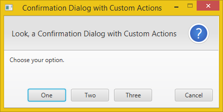

# 💬 DialogPane di JavaFX

  
  

 

**`DialogPane`** adalah kontainer tata letak khusus yang dirancang untuk menjadi bagian inti dari **Dialog** (jendela pop-up atau modal) standar di JavaFX. `DialogPane` memastikan struktur dan tata letak elemen-elemen dialog yang konsisten.

## 1. Konsep Dasar

* **Struktur Tetap**: `DialogPane` menyediakan struktur yang sudah ditentukan sebelumnya, memisahkan konten dialog menjadi beberapa area standar:
    * **Header/Judul** (dapat mencakup judul dan gambar).
    * **Content Area** (Area konten utama).
    * **Expandable Content Area** (Konten yang dapat diperluas, biasanya untuk detail teknis atau pesan kesalahan).
    * **ButtonBar** (Area tombol aksi).
* **Konten Terpusat**: Konten utama (Content Area) biasanya menampung `GridPane`, `VBox`, atau kontainer lain yang memegang input atau pesan dialog.

## 2. Mekanisme Tata Letak (DialogPane)

`DialogPane` mengatur tata letak anak-anaknya berdasarkan fungsionalitas, bukan hanya posisi spasial:

* **Header**: Node yang ditempatkan sebagai header (judul dan/atau ikon) selalu berada di **paling atas** dan diatur secara horizontal.
* **Content**: Node yang ditetapkan sebagai konten menempati bagian **tengah** utama. Ukuran area ini sangat bergantung pada ukuran konten anak yang disukainya.
* **`ExpandableContent`**: Node ini ditempatkan di bawah konten utama dan diatur agar dapat disembunyikan atau ditampilkan (diperluas/expanded), ideal untuk detail tambahan.
* **`ButtonBar`**: Kontainer `ButtonBar` secara otomatis ditempatkan di **paling bawah** dan bertanggung jawab untuk mengatur tombol aksi dialog sesuai dengan standar platform, seperti yang sudah kita bahas sebelumnya.

## 3. Kasus Penggunaan Populer

`DialogPane` adalah fondasi utama untuk semua jenis dialog standar dalam aplikasi JavaFX, memastikan tampilan yang seragam dan profesional:

* **Dialog Konfirmasi**: Digunakan untuk meminta konfirmasi pengguna ("Yakin ingin menghapus item ini?").
* **Dialog Peringatan/Kesalahan**: Digunakan untuk menampilkan pesan kesalahan kritis atau peringatan kepada pengguna.
* **Dialog Input**: Digunakan sebagai wadah untuk form input sederhana (misalnya, meminta nama pengguna atau kata sandi).

> [!TIP]
> `DialogPane` adalah kontainer **berbasis tujuan** yang menyediakan **struktur yang konsisten** dan tata letak yang sudah ditentukan sebelumnya untuk membuat *Dialog* aplikasi dengan cepat, mengintegrasikan `ButtonBar` di dalamnya secara otomatis.

---
Source: 