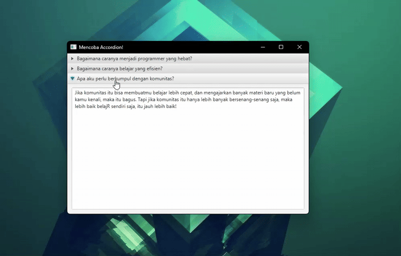

# 📚 Accordion di JavaFX

  

 

**`Accordion`** adalah komponen kontrol khusus di JavaFX yang dirancang untuk menampung dan mengelola koleksi Node anak yang disebut **`TitledPane`** (panel berjudul). Fungsinya adalah menyajikan informasi berlapis secara ringkas, di mana **hanya satu panel yang diizinkan untuk terbuka** pada satu waktu.

## 1. Konsep Dasar

* **Item Anak Khusus**: Tidak seperti kontainer lain, anak `Accordion` harus berupa **`TitledPane`**. Setiap `TitledPane` bertindak sebagai wadah untuk konten sesungguhnya.
* **Manajemen Ruang**: Ideal untuk menghemat ruang vertikal karena hanya sebagian kecil konten yang ditampilkan, sementara sisanya tersembunyi.
* **Komponen Induk**: `Accordion` secara otomatis mengontrol status `expanded` (kembang) dari setiap `TitledPane` di dalamnya.

## 2. Mekanisme Tata Letak (Accordion)

Mekanisme `Accordion` unik karena ia berfokus pada manajemen status dan eksklusivitas, bukan penempatan spasial murni:

### A. Eksklusivitas (Hanya Satu Buka)
* **Perilaku Kunci**: Ketika pengguna mengembangkan sebuah `TitledPane`, `Accordion` secara otomatis mencari `TitledPane` mana pun yang sedang terbuka dan **mencutkannya** (*collapsing*).
* **Keuntungan**: Ini memaksa fokus pengguna pada satu bagian konten, mengurangi kepadatan informasi.

### B. Pengelolaan Tinggi (*Height Management*)
* **Tinggi Dinamis**: Tinggi total `Accordion` akan secara dinamis menyesuaikan diri untuk mengakomodasi tinggi dari `TitledPane` yang **saat ini sedang terbuka**.
* **Ketinggian *TitledPane***: Node konten di dalam `TitledPane` akan menggunakan tinggi yang disukai, dan `Accordion` akan mengatur tata letaknya sesuai dengan tinggi tersebut.

### C. Pengaturan *TitledPane*
* Meskipun Node anak (`TitledPane`) diletakkan di dalam `Accordion` secara vertikal, pengembang biasanya hanya perlu peduli tentang **urutan** penambahan mereka, bukan posisinya yang spesifik.

## 3. Kasus Penggunaan Populer

`Accordion` sangat efektif untuk mengatur informasi yang terfragmentasi atau bertahap:

* **FAQ (Frequently Asked Questions)**: Setiap pertanyaan adalah judul `TitledPane`, dan jawabannya adalah konten, memastikan hanya satu jawaban yang dilihat pada saat bersamaan.
* **Menu Pengaturan Bertingkat**: Mengelompokkan pengaturan aplikasi ke dalam kategori yang jelas (misalnya, Jaringan, Akun, Tampilan) di *sidebar*.
* **Alur Kerja Bertahap (Step-by-Step)**: Menyajikan tahapan dalam proses, di mana pengguna harus menyelesaikan atau melihat satu tahapan sebelum melanjutkan.

> [!TIP]
> **`Accordion`** adalah kontrol kontainer yang menyediakan solusi **hemat ruang** dan **terorganisir** untuk menyajikan banyak `TitledPane`, dengan mekanisme utama yang memastikan **hanya satu bagian informasi** yang menjadi fokus pada waktu tertentu.

---

Source: [Gemini AI](https://gemini.google.com/app) | [Tutorialspoint](https://www.tutorialspoint.com/javafx/javafx_accordion.htm) | [Oracle](https://docs.oracle.com/javase/8/javafx/api/javafx/scene/control/Accordion.html)