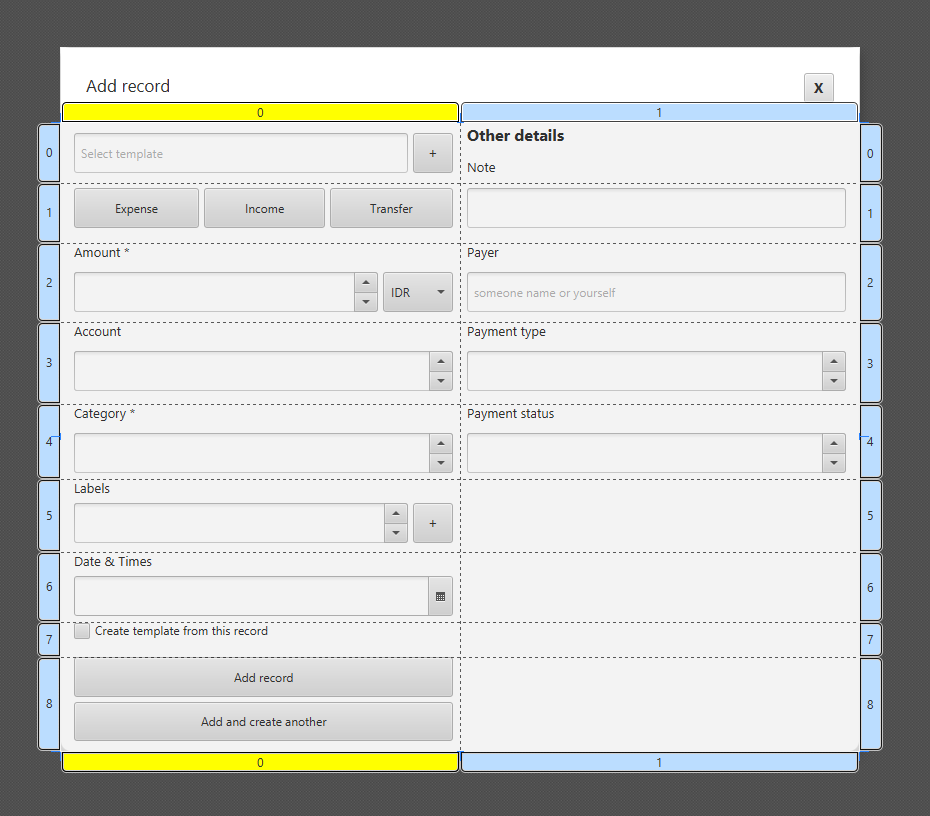

# 📐 GridPane di JavaFX

  
  

 

**`GridPane`** adalah kontainer tata letak yang paling kuat dan fleksibel untuk mengatur Node dalam struktur **baris dan kolom** (seperti *spreadsheet* atau tabel HTML). Ini adalah pilihan ideal untuk desain *form* dan tata letak yang kompleks dan terorganisir.

Seperti yang ditampilkan di dua gambar diatas. Gambar bagian kiri adalah form yang ingin dibuat. Untuk form yang rapi dan memiliki struktur grid seperti gambar kiri, sangat cocok menggunakan `Gridpane`, sehingga diguinakan `Gridpane` pada Scene Builder, seperti pada gambar dikanan.

## 1. Konsep Dasar

* **Sistem Koordinat**: Setiap Node anak ditempatkan dalam sel tertentu yang didefinisikan oleh pasangan koordinat **`(Kolom, Baris)`**. Penempatan dimulai dari kolom 0 dan baris 0.
* **Keseragaman**: Secara *default*, `GridPane` akan mencoba menyesuaikan ukuran kolom dan baris agar sesuai dengan ukuran yang disukai oleh elemen terbesar di dalamnya, namun ini dapat diatur ulang menggunakan *Constraints*.
* **Penambahan Node**: Anda menempatkan Node menggunakan metode *static*, misalnya: `GridPane.setConstraints(node, kolom, baris)`.

## 2. Mekanisme Tata Letak (GridPane)

Mekanisme `GridPane` didasarkan pada pengaturan ukuran dan posisi elemen dengan sangat detail:

### A. Spanning (Penggabungan Sel)
Anda dapat membuat sebuah Node menempati lebih dari satu sel menggunakan properti:
* `GridPane.setRowSpan(node, jumlah_baris)`: Membuat Node membentang vertikal melintasi beberapa baris.
* `GridPane.setColumnSpan(node, jumlah_kolom)`: Membuat Node membentang horizontal melintasi beberapa kolom (sering digunakan untuk header atau tombol "Submit").

### B. Constraints (Kendala Ukuran)
Ini adalah fitur kunci untuk kontrol yang baik. Anda menggunakan objek `RowConstraints` dan `ColumnConstraints` untuk menentukan bagaimana `GridPane` harus membagi ruang yang tersedia:

| Properti Constraint | Deskripsi | Kasus Penggunaan |
| :--- | :--- | :--- |
| **`PercentWidth/Height`** | Menentukan ukuran baris/kolom sebagai persentase dari total lebar/tinggi `GridPane`. | Membuat kolom sidebar mengambil 30% dari total lebar. |
| **`PrefWidth/Height`** | Menentukan ukuran tetap yang disukai. | Membuat kolom tombol tetap pada lebar 100 piksel. |
| **`Grow/Shrink`** | Menentukan apakah baris/kolom boleh meregang jika ada ruang kosong. | Memungkinkan kolom konten utama meregang untuk mengisi ruang. |

### C. Penataan Dalam Sel (Alignment)
Meskipun Node ditempatkan dalam sel, Anda dapat mengontrol perataan di dalam sel tersebut menggunakan:
* `GridPane.setHalignment(node, HPos)`: Perataan Horizontal (`LEFT`, `CENTER`, `RIGHT`).
* `GridPane.setValignment(node, VPos)`: Perataan Vertikal (`TOP`, `CENTER`, `BOTTOM`).

## 3. Kasus Penggunaan Populer

`GridPane` adalah pilihan terbaik untuk desain yang menuntut **penjajaran struktural** yang presisi:

* **Formulir Kompleks**: Kontainer utama untuk mengatur label dan bidang input (field) dalam tata letak dua kolom (Label di kiri, Input di kanan).
* **Tata Letak Kalkulator**: Susunan tombol yang rapi dalam baris dan kolom.
* **Dashboards**: Mengatur widget-widget data yang ukurannya berbeda-beda dan perlu mengisi ruang secara efisien dengan menggunakan *spanning*.
* **Kotak Dialog (Dialog Content)**: Sering digunakan sebagai konten di dalam `DialogPane` karena kemampuannya untuk menyusun input dengan rapi.

> [!TIP]
> `GridPane` menawarkan **kontrol tata letak yang sangat detail** berbasis matriks sel, menjadikannya *layout pane* terbaik untuk membangun antarmuka yang memerlukan penyelarasan *pixel-perfect*, terutama ketika dikombinasikan dengan `RowConstraints` dan `ColumnConstraints`.

---

Source: [Oracle](https://docs.oracle.com/javase/8/javafx/api/javafx/scene/layout/GridPane.html) | [Tutorialspoint](https://www.tutorialspoint.com/javafx/layout_gridpane.htm) | [Jenkov](https://jenkov.com/tutorials/javafx/gridpane.html)