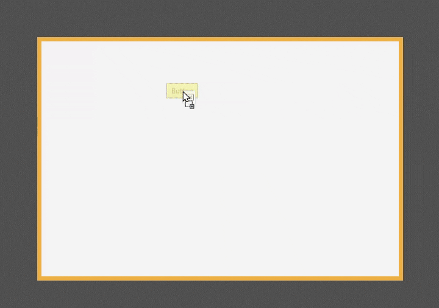

# ↔️ HBox di JavaFX

  

 

**`HBox`** adalah kontainer tata letak yang paling dasar dan sering digunakan untuk mengatur elemen anak-anaknya (Node) dalam satu baris **horizontal** lurus. Ini sangat ideal untuk membuat bilah alat (*toolbar*) atau baris tombol karena kesederhanaannya dalam menyusun elemen secara berdampingan.

Video demo diatas menampilkan bagaimana `Hbox` secara otomatis meletakan semua Child Node yang ada didalamnya secara horizontal. 

## 1. Konsep Dasar

* **Tata Letak Baris**: Semua Node yang ditambahkan ke `HBox` akan ditempatkan berurutan dari **kiri ke kanan**.
* **Ukuran Natural**: Secara *default*, `HBox` akan mencoba menggunakan lebar yang disukai (*preferred width*) dari setiap Node anak.
* **Spasi (`spacing`)**: Properti kunci yang memungkinkan Anda menentukan jarak yang konsisten (dalam piksel) antara setiap Node anak di baris tersebut.

## 2. Mekanisme Tata Letak (HBox)

Meskipun sederhana, `HBox` memiliki mekanisme pengaturan ukuran dan posisi yang penting untuk diperhatikan:

### A. Peregangan (Grow/Shrink)
Secara *default*, Node anak di dalam `HBox` **tidak akan meregang** (melebar) untuk mengisi ruang horizontal yang tersedia.

* **Mengaktifkan Peregangan**: Untuk membuat satu atau lebih Node meregang saat `HBox` melebar, Anda harus mengatur properti *static* **`Hgrow`** pada Node tersebut.
    * `HBox.setHgrow(node, Priority.ALWAYS)`: Node ini akan mengambil semua sisa ruang horizontal yang ada.
* **Prioritas Peregangan**: Jika beberapa Node diatur memiliki `Hgrow`, `HBox` akan membagi sisa ruang secara merata di antara mereka, atau berdasarkan prioritas jika ditentukan.

### B. Penjajaran (Alignment)
Properti **`alignment`** mengontrol dua hal:
1.  **Posisi Horizontal**: Di mana kumpulan Node ditempatkan dalam lebar total `HBox` (misalnya, `CENTER` atau `RIGHT`).
2.  **Posisi Vertikal**: Bagaimana Node yang memiliki tinggi berbeda disejajarkan secara vertikal di dalam baris (misalnya, `CENTER_LEFT` akan menempatkan Node di tengah vertikal).

### C. Pengaturan Ukuran Tinggi
Node anak di dalam `HBox` secara *default* akan meregang secara vertikal (tinggi) untuk mengisi tinggi total `HBox`, kecuali jika tinggi yang disukai Node telah ditetapkan secara eksplisit.

## 3. Kasus Penggunaan Populer

`HBox` adalah kontainer pilihan untuk tata letak satu dimensi horizontal yang cepat dan rapi:

* **Toolbar Aplikasi**: Baris tombol, *dropdown*, atau bidang teks pencarian yang harus disusun secara berurutan.
* **Footer atau Baris Tombol**: Menempatkan sepasang tombol aksi ("Simpan" dan "Batal") berdampingan, sering kali diletakkan di dalam `BorderPane` atau `VBox`.
* **Komponen Baris Tunggal**: Menyusun sebuah `Label` dan sebuah `TextField` bersebelahan dalam sebuah `GridPane` atau `VBox`.

> [!TIP]
> `HBox` adalah kontainer **esensial** untuk membuat urutan elemen horizontal yang rapi. Anda dapat mengontrol spasi dan, yang terpenting, secara selektif menentukan Node mana yang harus **meregang** untuk menggunakan ruang yang tersedia.

---

Source: [Oracle](https://docs.oracle.com/javase/8/javafx/api/javafx/scene/layout/HBox.html) | [GeeksforGeeks](https://www.geeksforgeeks.org/java/javafx-hbox-class/) | [Jenkov](https://jenkov.com/tutorials/javafx/hbox.html) | [Tutorialspoint](https://www.tutorialspoint.com/javafx/javafx_hbox_layout.htm)