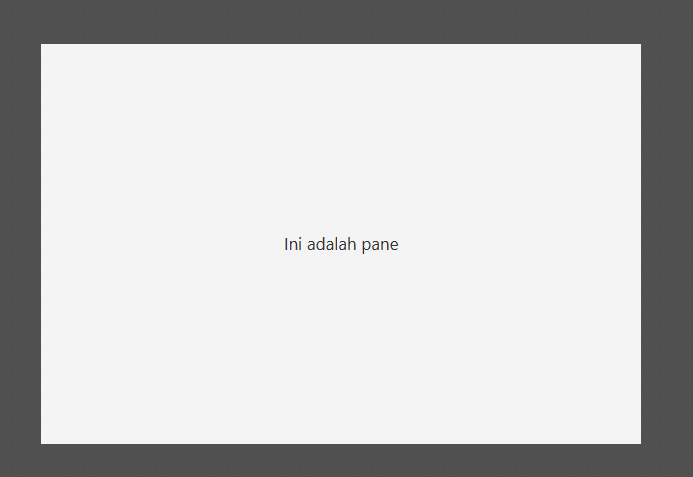

# 🧱 Pane di JavaFX

<div style="display: flex; gap: 10px;" align="center">
  
</div>

<br/>

**`Pane`** adalah kelas dasar abstrak untuk semua kontainer tata letak di JavaFX (seperti `HBox`, `VBox`, `GridPane`, dll.). Ketika digunakan secara langsung, **`Pane`** menawarkan tata letak yang paling **sederhana** dan **bebas** karena ia **tidak memiliki aturan posisi atau ukuran bawaan** untuk Node anak-anaknya.

## 1. Konsep Dasar

* **Kelas Dasar**: `Pane` adalah *superclass* dari semua *Layout Panes*. Menggunakan `Pane` secara langsung memberikan Anda sebuah kanvas kosong.
* **Tata Letak Manual**: Node anak di dalam `Pane` harus diposisikan secara eksplisit menggunakan properti **`layoutX`** dan **`layoutY`**.
* **Koordinat Absolut**: Posisi Node ditetapkan relatif terhadap sudut kiri atas `Pane` itu sendiri (`(0, 0)`). Ini dikenal sebagai tata letak berbasis **koordinat absolut** atau **manual**.
* **Tidak Ada *Resizing***: `Pane` tidak memiliki logika *resizing* otomatis untuk anak-anaknya; Node akan mempertahankan posisi `(X, Y)` mereka bahkan ketika `Pane` diubah ukurannya.

## 2. Mekanisme Tata Letak (Pane)

Mekanisme `Pane` adalah tentang intervensi langsung pengembang untuk setiap Node anak:

### A. Penentuan Posisi

* **Posisi X/Y**: Anda wajib mengatur posisi `layoutX` dan `layoutY` setiap Node anak.
  ```java
  myNode.setLayoutX(100); 
  myNode.setLayoutY(50);
  ```
* Jika properti posisi tidak diatur, Node akan ditempatkan di posisi **default** `(0, 0)` atau di mana *preferred size* mereka diletakkan.

### B. Perilaku Ukuran Ulang

* **Anak Tetap Statis**: Node anak akan tetap berada di lokasi absolut mereka (`layoutX`, `layoutY`) terlepas dari bagaimana ukuran jendela diubah. Mereka **tidak akan bergerak atau meregang** secara otomatis.
* **Perilaku *Resize***: Karena Node anak tidak diposisikan ulang oleh `Pane`, jika `Pane` diubah ukurannya, Node mungkin saja menjadi terpotong (tersembunyi) atau meninggalkan ruang kosong yang besar.
* **Minimum/Preferred Size**: `Pane` menggunakan ukuran yang disukai dari anak-anaknya saat menghitung ukuran yang disukai *dirinya sendiri*.

### C. Pengaturan Z-Order

Ketika dua Node tumpang tindih (memiliki koordinat yang sama), Node yang ditambahkan **terakhir** ke dalam daftar anak `Pane` akan berada di **lapisan atas** (*top of the stack* / *Z-order* yang lebih tinggi).

## 3. Kasus Penggunaan Populer

Karena `Pane` sangat *low-level*, ia sering digunakan untuk tujuan khusus, atau sebagai *base* untuk *custom layout* yang lebih kompleks:

* **Kanvas Gambar (Drawing Canvas)**: Menempatkan bentuk-bentuk grafis (`Shape` seperti `Circle` atau `Rectangle`) pada posisi yang sangat spesifik dan tetap.
* **Animasi**: Digunakan sebagai wadah di mana Node perlu dipindahkan menggunakan koordinat yang dihitung dan tepat.
* **Custom Layouts**: Ketika `AnchorPane` (yang memiliki logika *anchoring*) terlalu berlebihan, dan Anda hanya ingin menempatkan beberapa item pada posisi X/Y yang ditentukan.

> [!TIP]
> **`Pane`** adalah kontainer paling dasar dan **bebas**, memberikan kontrol penuh atas posisi absolut setiap Node anak melalui koordinat `(X, Y)`. Gunakan `Pane` hanya ketika Anda membutuhkan **tata letak manual** dan **tetap**.

---

Source: [Oracle](https://docs.oracle.com/javase/8/javafx/api/javafx/scene/layout/Pane.html) | [GeeksforGeeks](https://www.geeksforgeeks.org/java/javafx-pane-class/) | [Jenkov](https://jenkov.com/tutorials/javafx/pane.html)