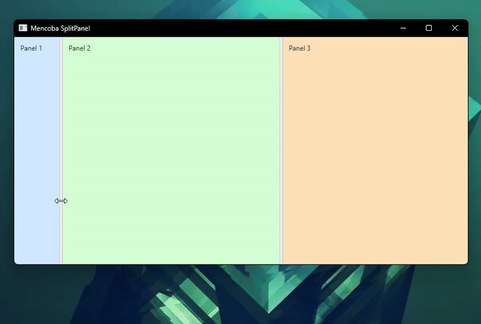

# 🪟 SplitPane di JavaFX

  

 

**`SplitPane`** adalah kontainer yang dirancang untuk menampung **dua atau lebih Node** dan membaginya dengan menggunakan **pembagi yang dapat diseret** (*draggable divider*). Kontainer ini memungkinkan pengguna untuk secara dinamis mengubah ukuran Node anak saat *runtime*, menjadikannya ideal untuk tata letak yang menampilkan beberapa panel berdampingan.

## 1. Konsep Dasar

* **Pembagian Dinamis**: `SplitPane` membagi ruangnya menjadi beberapa area yang disebut *items*, di mana setiap *item* diisi oleh satu Node anak.
* **Pembagi (Divider)**: Antar *item* dipisahkan oleh sebuah garis tipis yang disebut pembagi. Pengguna dapat mengeklik dan menyeret pembagi ini untuk mengubah alokasi ruang antar *item*.
* **Orientasi**: Anda dapat menentukan apakah pembagian dilakukan secara **Horizontal** (membuat panel kiri/kanan) atau **Vertikal** (membuat panel atas/bawah).

## 2. Mekanisme Tata Letak (SplitPane)

Perilaku utama `SplitPane` terletak pada cara ia mengelola pembagi dan alokasi ruang:

### A. Posisi Pembagi (`Divider Position`)
* **Proportional**: Posisi setiap pembagi ditetapkan menggunakan nilai **proporsional** antara 0.0 dan 1.0 (0% hingga 100%) dari lebar/tinggi total `SplitPane`.
* **Pengaturan Awal**: Properti `dividerPositions` diatur saat inisialisasi untuk mendefinisikan pembagian ruang awal.
* **Pengguna Mengontrol**: Perubahan yang dilakukan pengguna saat menyeret pembagi akan memperbarui nilai proporsional ini secara dinamis.

### B. Perilaku Anak (*Item* Properties)
Node anak di dalam `SplitPane` memiliki properti khusus:

* **`minWidth/minHeight`**: `SplitPane` akan **menghormati** ukuran minimum yang ditetapkan pada Node anak. Pengguna tidak dapat menyeret pembagi sehingga ukuran Node anak menyusut di bawah nilai minimum ini.
* **`collapsed`**: Anda dapat mengatur pembagi untuk **menciutkan** (*collapse*) salah satu *item* sehingga area tersebut menjadi tersembunyi.

### C. Orientasi
* **`Orientation.HORIZONTAL` (Default)**: Pembagi vertikal menciptakan tata letak **Kiri/Kanan** (paling umum).
* **`Orientation.VERTICAL`**: Pembagi horizontal menciptakan tata letak **Atas/Bawah**.

## 3. Kasus Penggunaan Populer

`SplitPane` adalah kontainer yang sangat efektif untuk aplikasi yang membutuhkan panel dengan ukuran yang fleksibel:

* **Jendela Kode Editor**: Membagi jendela menjadi tiga bagian (`TreeView` di kiri, editor kode di tengah, dan output konsol di bawah), sering kali menggunakan dua `SplitPane` (satu horizontal, satu vertikal).
* **Tampilan Master-Detail**: Panel *Master* (misalnya, daftar email) di sebelah kiri, dan panel *Detail* (konten email yang dipilih) di sebelah kanan, di mana pengguna dapat memperluas tampilan detail.
* **Pengaturan Jendela**: Membuat tata letak di mana pengguna dapat menyesuaikan ruang kerja mereka sendiri selama *runtime*.

> [!TIP]
> **`SplitPane`** adalah kontainer yang kuat yang memungkinkan **pembagian ruang yang adaptif dan dapat disesuaikan** antar Node anak, memberikan pengguna kontrol dinamis atas tata letak aplikasi.

---

Source: [Oracle](https://docs.oracle.com/javase/8/javafx/api/javafx/scene/control/SplitPane.html) | [Jenkov](https://jenkov.com/tutorials/javafx/splitpane.html) | [Tutorialspoint](https://www.tutorialspoint.com/javafx/javafx_splitpane.htm)