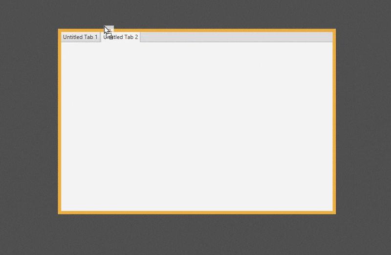

# 📑 TabPane di JavaFX

  

 

**`TabPane`** adalah kontrol yang berfungsi sebagai kontainer tingkat tinggi (bukan *layout pane* murni) yang dirancang untuk menampung banyak area konten di lokasi yang sama, namun hanya **satu** yang dapat dilihat pada satu waktu. Setiap area konten ini diakses melalui **Tab** (tabulasi) yang sesuai.

## 1. Konsep Dasar

* **Manajemen Konten**: `TabPane` memecah konten aplikasi menjadi halaman-halaman yang berbeda, mengurangi kekacauan visual dan meningkatkan organisasi.
* **`Tab` (Item Anak)**: Anak-anak dari `TabPane` bukanlah Node biasa, melainkan objek **`Tab`**. Setiap objek `Tab` berisi:
    * **Teks Tab** (judul yang terlihat oleh pengguna).
    * **Konten** (Node tunggal yang akan ditampilkan saat tab itu aktif).
* **Efisiensi Ruang**: Ideal untuk aplikasi dengan banyak fungsi atau pengaturan yang tidak perlu dilihat sekaligus.

## 2. Mekanisme Tata Letak (TabPane)

Perilaku utama `TabPane` adalah mengelola tampilan dan penempatan tab itu sendiri:

### A. Penempatan Tab (*Tab Placement*)
Properti **`side`** mengontrol di mana barisan tab diletakkan relatif terhadap konten:

* **`Side.TOP` (Default)**: Tab berada di atas konten (paling umum).
* **`Side.BOTTOM`**: Tab berada di bawah konten.
* **`Side.LEFT`**: Tab berada di sisi kiri (membentuk *sidebar* vertikal).
* **`Side.RIGHT`**: Tab berada di sisi kanan.

### B. Perilaku Ukuran Ulang
* **Konten Meregang**: Konten di dalam tab (Node anak tunggal dari objek `Tab`) akan **meregang penuh** untuk mengisi seluruh area konten `TabPane`.
* **Pemilihan Tab**: Hanya Node konten dari tab yang **sedang dipilih (`selected`)** yang aktif dan dirender. Konten dari tab lain tetap ada, tetapi tidak terlihat dan tidak memengaruhi tata letak.

### C. Fitur Tambahan
* **Tab yang Dapat Ditutup**: Anda dapat mengatur setiap tab agar memiliki tombol silang yang memungkinkan pengguna untuk menutup tab tersebut secara dinamis.
* **Penyesuaian Lebar**: `TabPane` juga mengelola bagaimana tab-tab disusun jika jumlah tab melebihi lebar yang tersedia (misalnya, dengan menyediakan tombol gulir otomatis).

## 3. Kasus Penggunaan Populer

`TabPane` adalah salah satu kontrol navigasi yang paling umum dan serbaguna dalam desain aplikasi:

* **Pengaturan Aplikasi (Settings)**: Memisahkan pengaturan menjadi kategori yang berbeda (misalnya, "Jaringan," "Akun," "Privasi").
* **Browser Web / Editor Kode**: Setiap halaman web atau *file* kode dibuka dalam tab baru.
* **Tampilan Master-Detail Kompleks**: Menampilkan beberapa jenis detail tentang item yang dipilih (misalnya, sebuah produk memiliki tab "Deskripsi," "Spesifikasi," dan "Ulasan").

> [!TIP]
> **`TabPane`** adalah kontrol **manajemen konten** yang sangat baik untuk menyusun sejumlah besar informasi yang dikelompokkan ke dalam halaman-halaman yang efisien dan mudah diakses, menghemat ruang layar secara signifikan.

---

Source: [Oracle](https://docs.oracle.com/javase/8/javafx/api/javafx/scene/control/Tab.html)