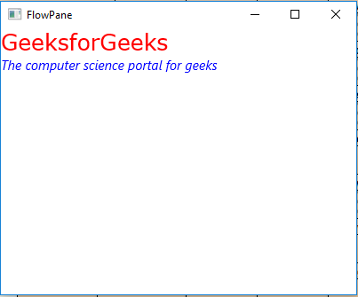
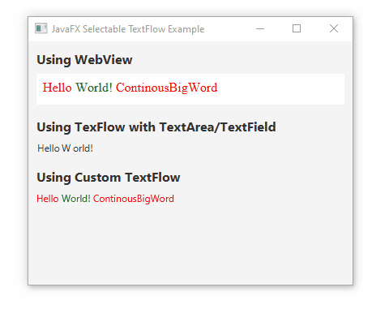

# 📝 TextFlow di JavaFX

  
  

 

**`TextFlow`** adalah kontainer tata letak khusus di JavaFX yang dirancang untuk menampilkan urutan **Node teks** (seperti `Text`, `Label`, atau bahkan `ImageView` dan `Button` di antara teks) yang **mengalir** dan **membungkus** (*wrap*) seperti sebuah paragraf teks standar.

## 1. Konsep Dasar

* **Fokus Teks**: Tujuan utama `TextFlow` adalah menyusun Node **sebaris** dan mengelola pembungkusan (wrapping) jika panjang baris melebihi batas kontainer.
* **Teks dengan Gaya Campuran**: Kontainer ini memungkinkan Anda untuk mencampur berbagai gaya teks (`Text` Node dengan font, warna, atau ketebalan berbeda) dan memperlakukannya sebagai satu paragraf yang koheren.
* **Integrasi Node Non-Teks**: Tidak seperti kontainer teks murni, `TextFlow` dapat menampung Node non-teks (misalnya, gambar kecil, tombol) tepat di antara aliran teks, dan Node tersebut akan tetap mengikuti aturan aliran dan pembungkusan.

## 2. Mekanisme Tata Letak (TextFlow)

Mekanisme `TextFlow` unik karena menggabungkan tata letak horizontal dengan aturan pembungkusan teks:

### A. Perilaku Aliran dan Pembungkusan
* **Pengaturan Sebaris**: Node anak diletakkan bersebelahan sesuai urutan penambahan.
* **Pembungkusan Otomatis**: Ketika lebar total Node di baris melebihi lebar `TextFlow`, elemen berikutnya akan secara otomatis pindah ke baris baru, memastikan seluruh konten tetap terlihat.

### B. Perataan Teks (*Text Alignment*)
Properti **`textAlignment`** menentukan perataan horizontal barisan teks di dalam kontainer:

* **`TextAlignment.LEFT` (Default)**: Teks rata kiri.
* **`TextAlignment.CENTER`**: Teks rata tengah.
* **`TextAlignment.RIGHT`**: Teks rata kanan.
* **`TextAlignment.JUSTIFY`**: Teks rata kiri dan kanan (penuh).

### C. Pengaturan Baris (*Line Spacing*)
Properti **`lineSpacing`** memungkinkan Anda mengatur jarak vertikal antar baris teks yang telah dibungkus, mirip dengan spasi baris dalam perangkat lunak pengolah kata.

## 3. Kasus Penggunaan Populer

`TextFlow` ideal digunakan ketika Anda perlu menyajikan teks yang memiliki variasi format atau memerlukan elemen interaktif tertanam:

* **Pesan Kaya (*Rich Message*)**: Menampilkan pesan atau komentar di mana beberapa kata perlu **ditebalkan**, diberi warna, atau diklik (*hyperlink*) tanpa harus menggunakan `WebView` atau HTML.
* **Dokumentasi atau Catatan dengan Aksi**: Menyertakan tombol (*Button*) atau ikon (`ImageView`) di tengah kalimat, dan memastikan elemen-elemen tersebut tetap berada di tempat yang benar ketika teks membungkus.
* **Konten Legal atau Perjanjian**: Menampilkan teks dengan format yang sangat spesifik, di mana perubahan gaya atau elemen lain harus mengikuti aliran baris.

> [!TIP]
> **`TextFlow`** adalah kontainer yang berharga untuk mengelola tampilan **teks dengan gaya campuran dan elemen tertanam** yang harus tetap mengikuti aturan **aliran dan pembungkusan paragraf** standar.

---

Source: [Oracle](https://docs.oracle.com/javase/8/javafx/api/javafx/scene/text/TextFlow.html) | [GeeksforGeeks](https://www.geeksforgeeks.org/java/javafx-textflow-class/) | [Tutorialspoint](https://www.tutorialspoint.com/javafx/javafx_textflow_layout.htm)