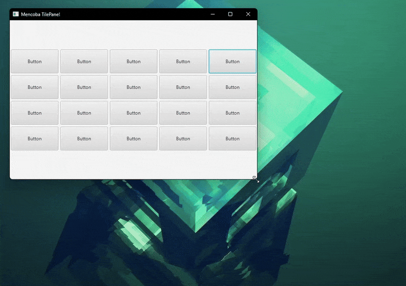

# 🧱 TilePane di JavaFX

  

 

**`TilePane`** adalah kontainer tata letak yang dirancang untuk mengatur semua Node anak-anaknya dalam **ubin** (*tile*) yang **seragam ukurannya**. Kontainer ini berusaha menampung ubin sebanyak mungkin dalam satu baris atau kolom sebelum membungkus ke yang berikutnya, mirip dengan `FlowPane`, tetapi dengan ukuran sel yang kaku.

## 1. Konsep Dasar

* **Ubin Seragam**: Semua Node anak diatur di dalam sel atau ubin yang memiliki **ukuran yang sama**. Ukuran ubin ditentukan oleh Node anak **terbesar** (*preferred size* terbesar) di dalamnya.
* **Perataan Pusat**: Setiap Node anak akan ditempatkan di **tengah** ubinnya sendiri, terlepas dari ukurannya yang sebenarnya (selama ukurannya tidak melebihi ubin).
* **Orientasi**: Seperti `FlowPane`, `TilePane` memiliki orientasi: Horizontal (membungkus ke baris baru) atau Vertikal (membungkus ke kolom baru).

## 2. Mekanisme Tata Letak (TilePane)

Mekanisme `TilePane` berputar pada keseragaman dan pembungkusan:

### A. Penentuan Ukuran Ubin
1.  `TilePane` menghitung *preferred size* (ukuran yang disukai) dari **semua** Node anak.
2.  Ukuran ubin ditetapkan sebagai **ukuran maksimum** (lebar maksimum dan tinggi maksimum) dari semua Node anak.
3.  Semua ubin (sel) akan memiliki lebar dan tinggi yang sama ini.

### B. Perilaku Aliran dan Pembungkusan
* **Orientasi Horizontal (Default)**: Node disusun dari kiri ke kanan. Ketika tidak ada lagi ruang horizontal yang tersisa, ia akan membungkus ke **baris baru** di bawah, memulai tata letak ubin baru.
* **Orientasi Vertikal**: Node disusun dari atas ke bawah. Ketika tidak ada lagi ruang vertikal yang tersisa, ia akan membungkus ke **kolom baru** di sebelah kanan.

### C. Pengaturan Spasi
* **`hgap` (Horizontal Gap)**: Jarak antara ubin secara horizontal.
* **`vgap` (Vertical Gap)**: Jarak antara ubin secara vertikal.

## 3. Kasus Penggunaan Populer

`TilePane` adalah pilihan yang sangat baik untuk menyusun elemen visual yang harus memiliki presentasi yang rapi dan terorganisir:

* **Menu Ikon (Icon Menu)**: Membuat bilah menu di mana setiap item menu direpresentasikan oleh ikon yang ditempatkan dalam ubin berukuran sama.
* **Galeri Gambar/Thumbnail**: Mirip dengan `FlowPane`, tetapi `TilePane` memastikan bahwa **semua gambar** memiliki area tampilan yang rapi dan seragam, bahkan jika gambar aslinya memiliki dimensi yang sedikit berbeda.
* **Papan Tombol (*Button Board*)**: Menyusun sekumpulan tombol yang ukurannya harus identik dalam tata letak yang terstruktur.

> [!TIP]
> **`TilePane`** adalah kontainer yang mengatur Node dalam **ubin yang seragam ukurannya**, menjadikannya kontainer yang ideal untuk membuat tata letak yang **rapi** dan **terstruktur** di mana presentasi visual yang konsisten antar elemen adalah prioritas.

---

Source: [Oracle](https://docs.oracle.com/javase/8/javafx/api/javafx/scene/layout/TilePane.html) | [Tutorialspoint](https://www.tutorialspoint.com/javafx/javafx_tilepane_layout.htm) | [Jenkov](https://jenkov.com/tutorials/javafx/tilepane.html)