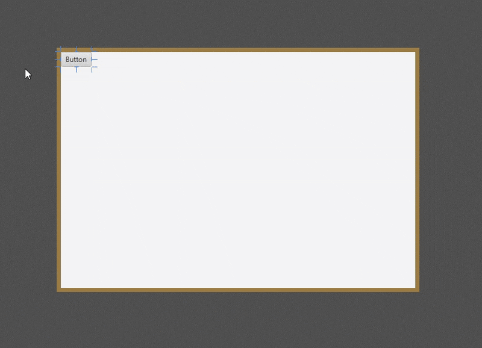

# ↕️ VBox di JavaFX

  

 

**`VBox`** adalah kontainer tata letak yang paling sederhana dan paling sering digunakan untuk mengatur elemen anak-anaknya (Node) dalam satu kolom **vertikal** lurus. Ini sangat ideal untuk membuat bilah sisi (*sidebar*) atau tumpukan elemen formulir karena kesederhanaannya dalam menyusun elemen dari atas ke bawah.

## 1. Konsep Dasar

* **Tata Letak Kolom**: Semua Node yang ditambahkan ke `VBox` akan ditempatkan berurutan dari **atas ke bawah**.
* **Spasi (`spacing`)**: Properti kunci yang memungkinkan Anda menentukan jarak yang konsisten (dalam piksel) antara setiap Node anak dalam kolom tersebut.
* **Lebar Penuh**: Node anak di dalam `VBox` secara *default* akan meregang secara horizontal untuk mengisi **lebar penuh** `VBox`.

## 2. Mekanisme Tata Letak (VBox)

`VBox` adalah cerminan dari `HBox`, tetapi berlaku untuk dimensi vertikal.

### A. Peregangan (Grow/Shrink)
Secara *default*, Node anak di dalam `VBox` **tidak akan meregang** (memanjang) untuk mengisi ruang vertikal yang tersisa.

* **Mengaktifkan Peregangan**: Untuk membuat satu atau lebih Node meregang saat `VBox` memanjang, Anda harus mengatur properti *static* **`Vgrow`** pada Node tersebut.
    * `VBox.setVgrow(node, Priority.ALWAYS)`: Node ini akan mengambil semua sisa ruang vertikal yang ada.
* **Prioritas Peregangan**: Jika beberapa Node diatur memiliki `Vgrow`, `VBox` akan membagi sisa ruang secara merata di antara mereka.

### B. Penjajaran (Alignment)
Properti **`alignment`** mengontrol dua hal:
1.  **Posisi Vertikal**: Di mana kumpulan Node ditempatkan dalam tinggi total `VBox` (misalnya, `CENTER` atau `BOTTOM`).
2.  **Posisi Horizontal**: Bagaimana Node yang memiliki lebar berbeda disejajarkan secara horizontal di dalam kolom (misalnya, `CENTER_LEFT` akan menempatkan Node di tengah horizontal).

### C. Pengaturan Ukuran Lebar
Node anak di dalam `VBox` secara *default* akan **meregang secara horizontal** (lebar) untuk mengisi lebar total `VBox`, kecuali jika lebar yang disukai Node telah ditetapkan secara eksplisit.

## 3. Kasus Penggunaan Populer

`VBox` adalah kontainer pilihan untuk tata letak satu dimensi vertikal yang cepat dan rapi:

* **Sidebar Navigasi**: Daftar tombol atau tautan yang disusun dari atas ke bawah.
* **Tumpukan Formulir**: Mengatur serangkaian input form secara vertikal (misalnya, Label, Input Teks, Tombol Submit).
* **Struktur Dialog**: Sering digunakan di dalam `DialogPane` untuk menampung konten dialog agar tersusun rapi secara vertikal.
* **Layout Kombinasi**: Digunakan untuk menumpuk bagian-bagian aplikasi (*Header*, *Konten*, *Footer*) secara vertikal, di mana *Konten* (atau Node dengan `Vgrow`) akan mengambil sisa ruang.

> [!TIP]
> **`VBox`** adalah kontainer yang **esensial** untuk membuat urutan elemen vertikal yang terorganisir. Anda dapat mengontrol spasi dan, yang terpenting, secara selektif menentukan Node mana yang harus **meregang secara vertikal** untuk mengisi ruang aplikasi yang tersedia.

---

Source: [Oracle](https://docs.oracle.com/javase/8/javafx/api/javafx/scene/layout/VBox.html) | [Tutorialspoint](https://www.tutorialspoint.com/javafx/javafx_vbox_layout.htm) | [GeeksoforGeeks](https://www.geeksforgeeks.org/java/javafx-vbox-class/) | [Jenkov](https://jenkov.com/tutorials/javafx/vbox.html)