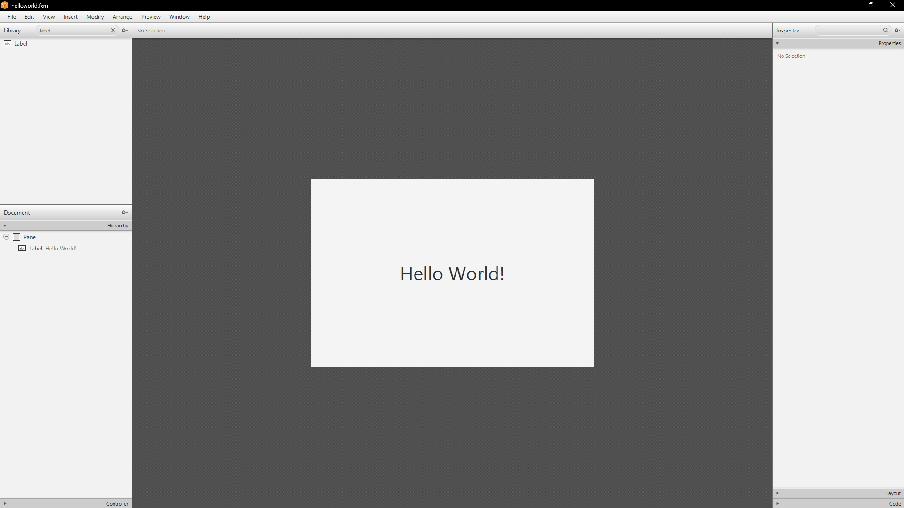
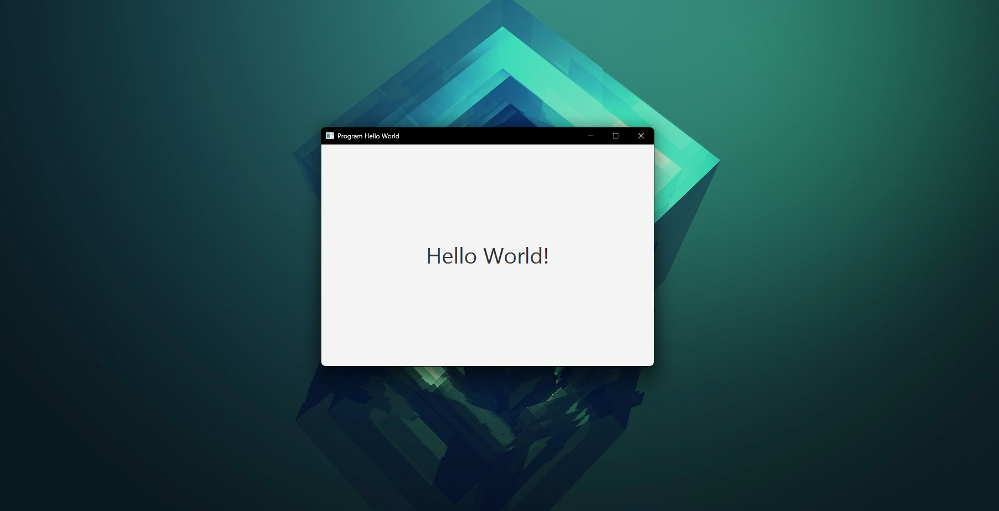

# JavaFX HelloWorld

Buatlah sebuah program JavaFX sederhana yang akan menampilkan sebuah jendela, dan tulisan berupa `Hello World!`. Ini adalah program sederhana, jadi cukup tampilkan tulisan saja.

Dibuat desain sebagai berikut pada SceneBuilder:



Desainya sederhana, digunakan 2 jenis library, yaitu:
1. Pane, yang digunakan sebagai container dari window. 
2. Label, tempat menuliskan pesan `Hello World!`.

Setelah dibuat, simpan pada `main/resources/fxml/helloworld.fxml`, maka bisa dilihat file `helloworld.fxml` yang dibuat adalah sebagai berikut:

```fxml
<?xml version="1.0" encoding="UTF-8"?>

<?import javafx.scene.control.Label?>
<?import javafx.scene.layout.Pane?>
<?import javafx.scene.text.Font?>


<Pane maxHeight="-Infinity" maxWidth="-Infinity" minHeight="-Infinity" minWidth="-Infinity" prefHeight="400.0" prefWidth="600.0" xmlns="http://javafx.com/javafx/25" xmlns:fx="http://javafx.com/fxml/1">
   <children>
      <Label alignment="CENTER" layoutX="51.0" layoutY="52.0" prefHeight="297.0" prefWidth="499.0" text="Hello World!" textAlignment="CENTER">
         <font>
            <Font size="40.0" />
         </font>
      </Label>
   </children>
</Pane>
```

Setelah itu, pada pada file `main/java/app/Main.java`, kita buat kode Java sebagai berikut:

```java
package app;

import javafx.application.Application;
import javafx.fxml.FXMLLoader;
import javafx.scene.Scene;
import javafx.stage.Stage;

public class Main extends Application {
    @Override
    public void start(Stage stage) throws Exception {
        FXMLLoader loader = new FXMLLoader(getClass().getResource("/fxml/helloworld.fxml"));
        stage.setScene(new Scene(loader.load()));
        stage.setTitle("Program Hello World");
        stage.show();
    }

    public static void main(String[] args) {
        launch();
    }
}
```

Setelah itu, jalankan dengan konfigurasi Maven pada file `pom.xml`, atau dengan membuat konfiguras perintah (jika menggunakan intellij) dengan syntax `javafx:run`.

Maka akan dihasilkan output sebagai berikut:



Oke, sekarang masuk ke tahap pemabahasan, yang akan membahasa semua hal yang perlu dibahas.

## Kenapa JavaFX?

Kita anggap kita masih awam terhadap JavaFX. Jadi kita akan membabat habis semua "tanda tanya" sehingga kita bisa memahami dengan lebih baik.

Seperti yang sudah dijelaskan sebelumnya, membuat aplikasi berbasis Graphical User Interface atau GUI pada Java memang umum dilakukan. Dan di Java, biasanya orang-orang akan menggunakan yang namanya Java Swing. Namun tampilan dari Java Swing terlalu kuno (walaupun sekarnag sudah ada library flatlaf yang bisa membuat tampilan Java Swing menjadi seperti intellij), tidak modular karena tidak memisahkan kode logika dengan kode yang mengatur tampilan, dan modifikasi desain yang terbatas.

Menggunakan fitur drag-and-drop pada plugin untuk Java Swing juga tidak terlalu disarankan, karena fitur tersebut men generate kode yang sulit dibaca, aneh, dan susah didebug. Intinya pengguna Java modern sudah banyak yang meninggalkan Java Swing ini.

Alternatifnya sekarang adalah apa yang sedang kita pakai, yaitu menggunakan JavaFX. Library untuk membuat Java GUI yang... Well, penjelasan tentang ini sudah dibahas panjang di bagian depan repositori harusnya, jadi baca saja [README.md](../../../README.md) ku wkwkkw.

Nah, untuk menggunakan JavaFX, kita justru diperbolehkan dan disarankan menggunakan fitur drag-and-drop yang diberikan, yaitu dengan menginstall aplikasi terpisah yang bernama SceneBuilder, yang bisa diunduh lewat [Gluonhq](https://gluonhq.com/products/scene-builder/).

## Kenapa menggunakan SceneBuilder?

Untuk emngatur tampilan JavaFX, kita bisa menggunakan Java code atau FXML. Tetapi menuliskan langsung secara manual jelas tidak efisien. Jadi, akan jauh lebih baik jika menggunakan file FXML. File FXML adalah file yang mendeskripsikan UI dari JavaFX, dan kita akan dibuatkan kode dari desain yang kita buat lewat SceneBuilder, cukup dengan load file FXML itu dengan:

```java
FXMLLoader.load(getClass().getResource("main-view.fxml"));
```

Maka kita sudah bisa menampilkan program Java dengan desain yang kita mau.

Selain itu, pemisahakan kode membuat program lebih modular. Kita memisahkan kode logika, dengan kode UI. Logika diurus oleh Java, sedangkan UI diurus oleh file FXML. Ini membuat kode kita lebih mudah di maintain, debug, dan lebih mudah melakukan kolaborasi.

Dan alasan terakhir untuk menggunakan SceneBuilder, adalah WYSIWYG, atau _What You See Is What You Get._ Fitur seperti:

- responsive layout
- anchor constraints
- vbox/hbox spacing
- alignment control

…lebih mudah dilihat secara visual daripada ngetik “setPadding(new Insets(10))” tiap 3 detik. 

Kesimpulanya, tidak wajib menggunakan SceneBuilder, kita tetap bisa membuat UI dengan mengetik langsung. Tapi SceneBuilder ini akan sangat mempermudah hidup, apalagi jika ingin membuat desain UI yang kompleks.

## Konfigurasi pom.xml

Ada banyak automation build tool untuk Java, dan aku menggunakan Maven. Ini mempermudah kita membuat dan mengelola projek. Misal jika kita membutuhkan library tertentu, kita tidak perlu repot-repot instal dan pasang manual, cukup copy-paste kode dependency dari [Maven Repositroy](https://mvnrepository.com/), dan kita sudah berhasil memasang library yang kita mau. 

Selain itu, proses build dan lain sebagainya juga bisa dikonfigurasi. Intinya banyak hal menjadi lebih mudah dengan menggunakan bantuan automation build tool Maven ini. Yasudah, aku memutuskan untuk menggunakan Maven untuk projekan JavaFX.

Ikuti step ini:

1. Buat projek baru dengan langsung menggunakan Maven sebagai projek managernya. Jika menggunakan Intellij, proses ini seharusnya mudah, kalau bingung, tanya AI aja, dan pasti bakal tahu kalau proses ini itu mudah.
2. Setelah mendapatkan file `pom.xml`, maka kita perlu memasang beberapa dependency yang dibutuhkan, antara lain:
    - [JavaFX Controls](https://mvnrepository.com/artifact/org.openjfx/javafx-controls) - Digunakan untuk mendapatkan komponen UI seperti Button, TextField, Label, dll. Ini yang paling sering dipakai. Salah satu dependency yang bisa dipasang mungkin seperti ini (yang berasal dari versi terbaru):

        ```xml
        <!-- https://mvnrepository.com/artifact/org.openjfx/javafx-controls -->
        <dependency>
            <groupId>org.openjfx</groupId>
            <artifactId>javafx-controls</artifactId>
            <version>26-ea+18</version>
        </dependency>
        ```
      
   -  [JavaFX FXML](https://mvnrepository.com/artifact/org.openjfx/javafx-fxml) - Digunakan jika ingin membuat tampilan UI dari file FXML. Jika menggunakan SceneBuilder, dependency ini harus ada.

        ```xml
        <!-- https://mvnrepository.com/artifact/org.openjfx/javafx-fxml -->
        <dependency>
            <groupId>org.openjfx</groupId>
            <artifactId>javafx-fxml</artifactId>
            <version>26-ea+18</version>
        </dependency>
        ```
   
   - [JavaFX Graphics](https://mvnrepository.com/artifact/org.openjfx/javafx-graphics) - Ini adalah modul inti rendering dan scene graph, tanpa ini, JavaFX tidak akan berjalan. Seperti ini kode depencenynya dari versi terbaru:

        ```xml
        <!-- https://mvnrepository.com/artifact/org.openjfx/javafx-graphics -->
        <dependency>
            <groupId>org.openjfx</groupId>
            <artifactId>javafx-graphics</artifactId>
            <version>26-ea+18</version>
        </dependency>
        ```
   - [JavaFX Base](https://mvnrepository.com/artifact/org.openjfx/javafx-base) - Fundamental utilities + property system. Berikut kode dependencynya:

       ```xml
       <!-- https://mvnrepository.com/artifact/org.openjfx/javafx-base -->
       <dependency>
           <groupId>org.openjfx</groupId>
           <artifactId>javafx-base</artifactId>
           <version>26-ea+18</version>
       </dependency>
       ```

   - Beberapa dependency yang bisa dipasang, namun bersifat opsional, antara lain seperti: [javafx-media](https://mvnrepository.com/artifact/org.openjfx/javafx-media), [javafx-web](https://mvnrepository.com/artifact/org.openjfx/javafx-web), [javafx-swing](https://mvnrepository.com/artifact/org.openjfx/javafx-swing), [javafx-swt](https://mvnrepository.com/artifact/org.openjfx/javafx-swt).

3. Setelah memasang semua dependency yang dibutuhkan, yang kurang lebih seperti ini berarti:

    ```xml
    <dependencies>
        <!-- https://mvnrepository.com/artifact/org.openjfx/javafx-controls -->
        <dependency>
          <groupId>org.openjfx</groupId>
          <artifactId>javafx-controls</artifactId>
          <version>26-ea+18</version>
        </dependency>
        <!-- https://mvnrepository.com/artifact/org.openjfx/javafx-fxml -->
        <dependency>
            <groupId>org.openjfx</groupId>
            <artifactId>javafx-fxml</artifactId>
            <version>26-ea+18</version>
        </dependency>
        <!-- https://mvnrepository.com/artifact/org.openjfx/javafx-graphics -->
        <dependency>
            <groupId>org.openjfx</groupId>
            <artifactId>javafx-graphics</artifactId>
            <version>26-ea+18</version>
        </dependency>
        <!-- https://mvnrepository.com/artifact/org.openjfx/javafx-base -->
        <dependency>
            <groupId>org.openjfx</groupId>
            <artifactId>javafx-base</artifactId>
            <version>26-ea+18</version>
        </dependency>
    </dependencies>
    ```

    Jika sudah, maka langkah selanjutnya adalah lakukan sinkroninasi file `pom.xml` untuk mengunduh dependency tersebut. Tunggu hingga proses selesai, pastikan tidak ada yang error. Jika ada yang error, baca pesan error tersebut dengan teliti, biasanya masalah terletak pada versi atau artifactID yang tidak dikenali. Jika hal ini terjadi, maka cukup cek lagi dependency tersebut ke Maven Repository, dan salin dependency yang baru.

> [!CAUTION]
> Apabila aplikasi membutuhkan modul lain seperti `javafx-media`, `javafx-graphics`, atau `javafx-web`, modul tersebut dapat ditambahkan sesuai kebutuhan. Namun jika tidak digunakan, maka tidak perlu dipasang, karena hanya akan membebani program dan menjadi bloat.

Jika semua proses berjalan lancar, maka selanjutnya adalah konfigurasi build.

Karena JavaFX tidak lagi menjadi bagian dari JDK, Maven perlu tahu modul apa saja yang digunakan, serta class mana yang menjadi titik masuk aplikasi. Semua pengaturan ini ditempatkan di dalam bagian `<build>` pada `pom.xml`.

Sebelum masuk ke konfigurasi detail, mari kita lihat terlebih dahulu plugin apa saja yang diperlukan untuk menjalankan dan membangun aplikasi JavaFX melalui Maven.
Plugin-plugin ini digunakan untuk menjalankan JavaFX langsung dari Maven, serta menghasilkan berkas JAR yang dapat dieksekusi.

1. [JavaFX Maven Plugin](https://mvnrepository.com/artifact/org.openjfx/javafx-maven-plugin) - Plugin utama yang bertugas menjalankan aplikasi JavaFX melalui perintah `mvn javafx:run`. Contoh kode dependency:

    ```xml
    <!-- https://mvnrepository.com/artifact/org.openjfx/javafx-maven-plugin -->
    <dependency>
        <groupId>org.openjfx</groupId>
        <artifactId>javafx-maven-plugin</artifactId>
        <version>0.0.8</version>
    </dependency>
    ```

2. [Apache Maven Shade Plugin](https://mvnrepository.com/artifact/org.apache.maven.plugins/maven-shade-plugin) - Digunakan untuk menghasilkan _fat JAR_ atau _uber-jar_, yaitu JAR yang berisi seluruh dependency aplikasi. Dengan plugin ini, aplikasi dapat dijalankan menggunakan `java -jar` tanpa pengaturan classpath yang rumit.

    ```xml
    <!-- https://mvnrepository.com/artifact/org.apache.maven.plugins/maven-shade-plugin -->
    <dependency>
        <groupId>org.apache.maven.plugins</groupId>
        <artifactId>maven-shade-plugin</artifactId>
        <version>3.6.1</version>
    </dependency>
    ```

3. [Apache Maven Compiler Plugin](https://mvnrepository.com/artifact/org.apache.maven.plugins/maven-compiler-plugin) - Plugin ini memastikan bahwa Maven menggunakan versi bahasa Java yang sesuai dengan JDK yang digunakan saat proses kompilasi.

    ```xml
    <!-- https://mvnrepository.com/artifact/org.apache.maven.plugins/maven-compiler-plugin -->
    <dependency>
        <groupId>org.apache.maven.plugins</groupId>
        <artifactId>maven-compiler-plugin</artifactId>
        <version>3.14.1</version>
    </dependency>
    ```

> [!CAUTION]
> Masing-masing dari plugin diatas perlu konfigurasi tambahan, yang akan dibahas di konfigurasi `pom.xml` final!

Sekarang perhatikan bahwa ketiga plugin tersebut dibungkus oleh blok `<dependency>`. Tapi karena kita membutuhkan dependency diatas sebagai plugin, maka ganti blok tersebut menjadi `<plugin>`. Ini karena Maven Repo tidak bisa membedakan apakah sebuah artifact itu akan digunakan sebagai dependency, plugin, exstension, atau tool lain, sehingga kita harus menggantinya secara manual. 

Sehingga kode akhir yang didapat adalah sebagai berikut:

```xml
<plugin>
    <groupId>org.openjfx</groupId>
    <artifactId>javafx-maven-plugin</artifactId>
    <version>0.0.8</version>
</plugin>
```

dan...

```xml
<plugin>
    <groupId>org.apache.maven.plugins</groupId>
    <artifactId>maven-shade-plugin</artifactId>
    <version>3.6.1</version>
</plugin>
```

Setelah memahami bahwa snippet dari Maven Repository tidak selalu mencerminkan cara pemakaian yang benar, langkah selanjutnya adalah menuliskan plugin tersebut pada lokasi yang tepat di dalam `pom.xml`.

Dalam Maven, semua plugin harus ditempatkan di dalam bagian `<build>` → `<plugins>`.
Inilah yang membuat Maven tahu bagaimana menjalankan, membangun, atau mengemas aplikasi JavaFX.

Contoh penulisan plugin yang benar:

```xml
<build>
    <plugins>

        <!-- Plugin untuk menjalankan JavaFX -->
        <plugin>
            <groupId>org.openjfx</groupId>
            <artifactId>javafx-maven-plugin</artifactId>
            <version>0.0.8</version>
        </plugin>

        <!-- Plugin untuk membuat fat-jar -->
        <plugin>
            <groupId>org.apache.maven.plugins</groupId>
            <artifactId>maven-shade-plugin</artifactId>
            <version>3.6.1</version>
        </plugin>
        <!-- https://mvnrepository.com/artifact/org.apache.maven.plugins/maven-compiler-plugin -->
        <plugin>
            <groupId>org.apache.maven.plugins</groupId>
            <artifactId>maven-compiler-plugin</artifactId>
            <version>3.14.1</version>
        </plugin>

    </plugins>
</build>
```

Dengan cara ini, Maven akan mengenali kedua plugin tersebut sebagai bagian dari proses build, bukan sebagai dependency runtime.

Jika semua proses berjalan lancar, maka selanjutnya adalah konfigurasi build.
Pada tahap ini, kita perlu memastikan bahwa project memiliki plugin yang tepat—bukan sekadar ada, tapi dipahami kegunaannya. Banyak pemula asal tempel konfigurasi dari StackOverflow, terus bingung sendiri kalau build macet.

## Konfigurasi pom.xml Final

### Plugin JavaFX Maven

Plugin ini memungkinkan aplikasi dijalankan langsung melalui perintah:

```
mvn javafx:run
```

Konfigurasinya sebagai berikut:

```xml
<build>
    <plugins>
        <plugin>
            <groupId>org.openjfx</groupId>
            <artifactId>javafx-maven-plugin</artifactId>
            <version>0.0.8</version>
            <configuration>
                <mainClass>${package-Anda.nama-file-Anda}</mainClass>
            </configuration>
        </plugin>
```

Katakanlah kita memiliki file Java yang menjadi program utama yaitu app.Main. Maka ganti `<mainClass>` menjadi:

```xml
<mainClass>app.Main</mainClass>
```

### Plugin Maven Compiler

Plugin ini memastikan Maven menggunakan versi bahasa Java yang sesuai dengan JDK yang digunakan.

```xml
        <plugin>
            <groupId>org.apache.maven.plugins</groupId>
            <artifactId>maven-compiler-plugin</artifactId>
            <version>3.11.0</version>
            <configuration>
                <source>17</source>
                <target>17</target>
            </configuration>
        </plugin>
```

Versi `source` dan `target` sebaiknya menyesuaikan dengan JDK Anda (misalnya 17, 21, dan seterusnya). Bisa dicek diterminal dengan perintah `java -version`, yang mana hasilnya biasanya seperti ini:

```bash
java version "20.0.2" 2023-07-18
Java(TM) SE Runtime Environment (build 20.0.2+9-78)
Java HotSpot(TM) 64-Bit Server VM (build 20.0.2+9-78, mixed mode, sharing)
```
Sehingga aku perbarui isi dari `source` dan `target` menjadi sebagai berikut:

```xml
<source>20</source>
<target>20</target>
```

> [!CAUTION]
> Catatan: Pada beberapa lingkungan, hasil komando tersebut dapat berbeda dari JDK yang digunakan Maven, terutama jika `JAVA_HOME` dikonfigurasi berbeda atau IDE menggunakan JDK lain. Pastikan `JAVA_HOME` mengarah ke JDK yang benar.

### Plugin Maven Shade (Opsional)

Plugin ini digunakan apabila Anda ingin menghasilkan *fat JAR* atau *uber JAR*, yakni satu berkas JAR yang sudah berisi seluruh dependensi. Dengan ini, aplikasi dapat dijalankan menggunakan:

```
java -jar nama-aplikasi.jar
```

Konfigurasi:

```xml
        <plugin>
            <groupId>org.apache.maven.plugins</groupId>
            <artifactId>maven-shade-plugin</artifactId>
            <version>3.5.0</version>
            <executions>
                <execution>
                    <phase>package</phase>
                    <goals>
                        <goal>shade</goal>
                    </goals>
                    <configuration>
                        <transformers>
                            <transformer implementation="org.apache.maven.plugins.shade.resource.ManifestResourceTransformer">
                                <mainClass>app.Main</mainClass>
                            </transformer>
                        </transformers>
                    </configuration>
                </execution>
            </executions>
        </plugin>
    </plugins>
</build>
```

Konfigurasi di atas:

- Sudah mencakup seluruh kebutuhan dasar untuk menjalankan JavaFX melalui Maven.
- Mendukung pembuatan *fat JAR* apabila diperlukan.
- Menggunakan struktur yang umum dalam pengembangan aplikasi JavaFX modern.
- Dapat digunakan pada Windows, Linux, maupun macOS.

> [!TIP]
> Proses pembuatan file jar dengan plugin tersebut masih dieskplorasi! Mungkin akan dibahas di latihan mendatang!